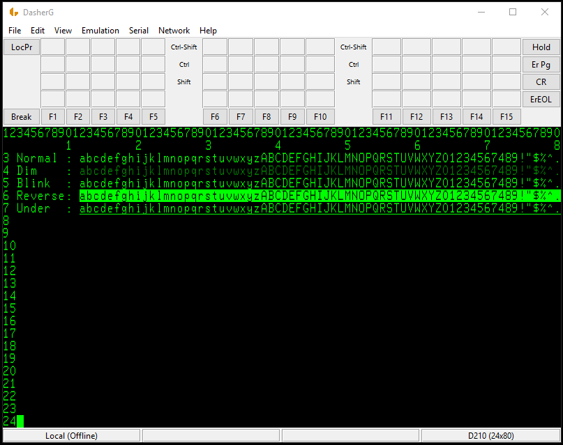

# DasherG
DasherG is a free terminal emulator for Data General DASHER series character-based terminals.  It is written in [Go](https://golang.org/) using the [Go-Gtk](https://github.com/mattn/go-gtk) toolkit and should run on all common platforms supported by Go.



## Key Features

* Serial interface support at 300, 1200, 2400, 4800, 9600 & 19200 baud, 7 or 8 data bits (defaults to 9600, 8, n, 1)
* BREAK key support for serial interface - permits use as master console
* Network Interface (Telnet) support
* DASHER D200 & D210 Emulation
* 15 (plus Ctrl & Shift) DASHER Function keys, Erase Page, Erase EOL, Hold, Local Print and Break keys
* Reverse video, blinking, dim and underlined characters
* Various terminal widths, heights and zoom-levels available
* Pixel-for-pixel copy of D410 character set
* Session logging to file
* Loadable function key templates (BROWSE, SED and SMI provided as examples)
* 2000-line terminal history
* May specify ```-host=host:port``` on command line
* Support for mini-Expect scripts to automate some tasks [see Wiki](https://github.com/SMerrony/DasherG/wiki/DasherG-Mini-Expect-Scripts)
* Copy and Paste - select region with mouse (it is automatically copied to clipboard) and paste at cursor via Edit menu
* XMODEM-CRC file transfer with short (128) or long (1024) packets

## Download
DasherG is [hosted on GitHub](https://github.com/SMerrony/DasherG).

## Build from Source
### Prerequisites
To build from the source you will need the GTK-Development packages installed on your system.  You will also need to install the following Go packages...

```go get github.com/mattn/go-gtk/gtk``` 

and 

```go get github.com/distributed/sers```

### Build
```go build```

or, if you prefer

```go install```

## Running DasherG
From the build or install directory simply type

```./DasherG```

Optionally, you may add the ```-host=host:port``` argument to connect to a running host via telnet. Eg. 

```./DasherG -host=localhost:23```

For a full list of all available DasherG options type

```./DasherG -h```

### Function Keys
You may have to use the keys simulated on the toolbar in DasherG as your OS might interfere with the physical function keys on your keyboard.  The Shift and Control keys can be used in conjunction with the simulated F-keys just like a real Dasher.

The "Brk" button sends a Command-Break signal to the host when connected via the serial interface.

"Hold" and "Local Print" work as you would expect, although the print actually goes to a user-specified image (PNG) file.

### Bell Sound

For the system bell to operate, DasherG must have been started from a terminal which supports the bell.

### Copy and Paste
To copy text from the terminal simply swipe over it with the left mouse button pressed.  The selected text will be temporarilly underlined and when you release the mouse button it will be automatically copied to the system clipboard.

Pasting always occurs at the current cursor position and is triggered from the Edit | Paste menu.

### Emulation Details
[See here](https://github.com/SMerrony/DasherG/blob/master/implementationChart.md)
