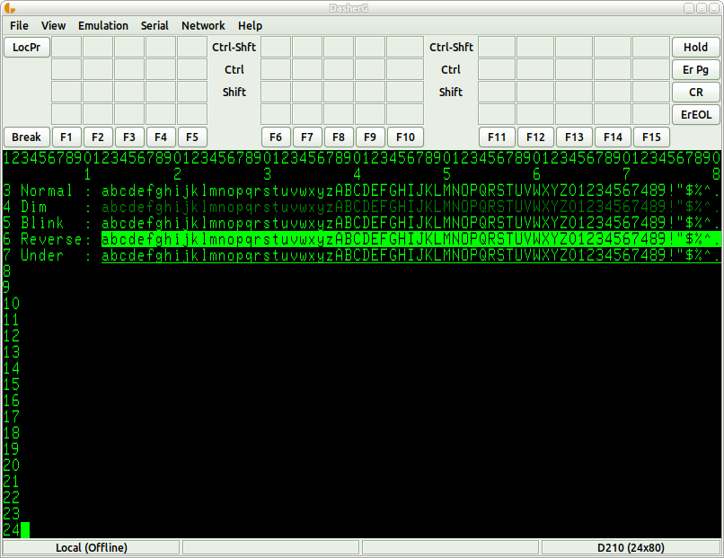

# DasherG
DasherG is a new free terminal emulator for Data General DASHER series character-based terminals.  It is written in [Go](https://golang.org/) using the [Go-Gtk](https://github.com/mattn/go-gtk) toolkit and should run on all common platforms supported by Go.



## Key Features

* ~~Serial interface support at 1200, 2400, 4800, 9600 & 19200 baud, 7 or 8 data bits (defaults to 9600, 8, n, 1)~~
* Network Interface (Telnet) support
* Dasher D200, D210 ~~& D211~~ Emulation
* 15 (plus Ctrl & Shift) Dasher Function keys, Erase Page, Erase EOL, Hold, Local Print and md-Break keys
* Reverse video, blinking, dim and underlined characters
* Various terminal widths, heights and zoom-levels available
* Pixel-for-pixel copy of D410 character set
* Session logging to file
* ~~Loadable function key templates (BROWSE, SED and SMI provided as examples)~~
* ~~Reconnect function (over telnet)~~
* ~~2000-line terminal history~~

## Download
DasherG is [hosted on GitHub](https://github.com/SMerrony/aosvs-tools/tree/master/dasherg).

## Build from Source
### Prerequisites
To build from the source you will need the GTK-Development packages installed on your system.  You will also need to install the following Go packages...

```go get github.com/mattn/go-gtk/gtk```

### Build
```go build```

or, if you prefer

```go install```

## Running DasherG
From the build or install directory simply type

```./dasherg```

Optionally, you may add the ```-host=host:port``` argument to connect to a running host via telnet. Eg. 

```./dasherg -host=localhost:23```
